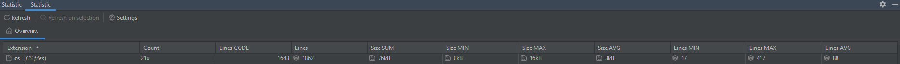
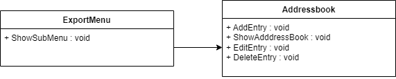
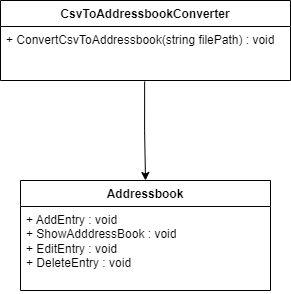
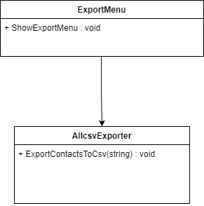
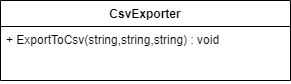
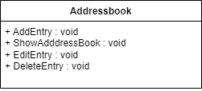
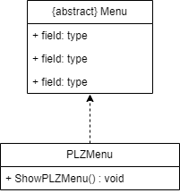
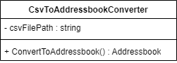
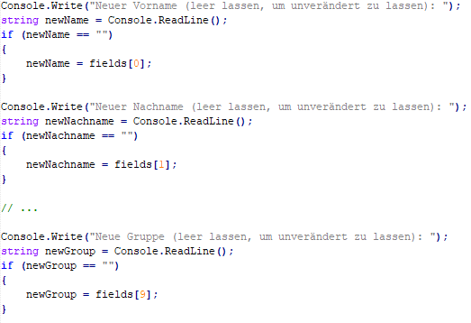
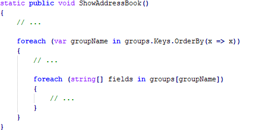

# Adressbuch

##### Name: Gangl, David Fabian

##### Matrikelnummer: 7487134

##### Abgabedatum: 31.05.2022

## Grundvoraussetzungen

Die Statistik-Auswertung wurde in der Entwicklungsumgebung Jetbrains Rider mit dem [Statistic-Plugin](https://plugins.jetbrains.com/plugin/4509-statistic) durchgeführt. Dazu wurde nur die Dateiendung .cs betrachtet und alle Ordner außerhalb des P2P2PP-Projekts ausgeschlossen. Auch das UnitTest-Projekt wurde ausgeschlossen.

Die Voraussetzung von 20 Klassen wurde mit 21 Klassen übertroffen und die Vorraussetzung mit 2000 Zeilen Code wurde nicht erfüllt, da es nur 1643 sind.

## Einführung (4P)

## Übersicht über die Applikation (1P)

> _Was macht die Applikation? Wie funktioniert sie? Welches Problem löst sie/welchen Zweck hat sie?_

Das Adressbuch-Projekt ist eine Anwendung, die es dem Benutzer ermöglicht, Kontakte zu verwalten und zu organisieren. Mit der Anwendung können Benutzer neue Kontakte hinzufügen, bestehende Kontakte bearbeiten oder löschen sowie nach Kontakten suchen und diese exportieren (Um diese auch in Outlook importieren zu können). Das Hauptziel des Projekts besteht darin, dem Benutzer ein effektives Werkzeug zur Verfügung zu stellen, um seine Kontakte zu organisieren und schnell auf sie zugreifen zu können. Die Anwendung speichert die Kontakte in einer Textdatei und bietet dem Benutzer eine einfache, benutzerfreundliche Oberfläche, um mit ihnen zu interagieren. Durch die Möglichkeit, Kontakte in Gruppen oder mit Tags zu organisieren, können Benutzer ihre Kontakte besser kategorisieren und verwalten. Insgesamt bietet das Adressbuch-Projekt eine einfache und effektive Lösung für die Organisation und Verwaltung von Kontakten.

---

## Starten der Applikation (1P)

> _Wie startet man die Applikation? Was für Voraussetzungen werden benötigt? Schritt-für-Schritt-Anleitung_

#### Voraussetzungen

-   [.NET 6.0](https://dotnet.microsoft.com/en-us/download/dotnet/6.0) Framework

##### Starten der Applikation

Die notwendigen Dateien in ein gemeinsames Verzeichnis legen:
- Addressbuch.dll
- Addressbuch.runtimeconfig.json

Die Applikation kann mit dem Befehl "dotnet Addressbuch.dll" gestartet werden.

##### Beispielhafter Ablauf

Um ein beispielhaften Durchlauf zum Anlegen und Anschnauen des Adressbuches durchzuführen, müssen folgende Befehle eingeben werden:
1. N
	=> Um einen neuen Benutzer anzulegen, alle Werte eingeben.
2. A
	=> Um sich das Adressbuch anzeigen zu lassen.
3. Enter
	=> Um wieder das Hauptmenü zu sehen.
4. E
	=> Export-Menü wird nun angezeigt
5. C
	=> Eingabeaufforderung erscheint
6. Vor und Nachname des Kontakts angeben
7.  "Enter"
8. Z
	=> Um ins Hauptmenü zu gelangen.
9. B
	=> Um das Programm zu beenden.

Somit wurde ein Kontakt angelegt und in einer CSV Datei gespeichert.

---

#### Technischer Überblick (2P)

> _Nennung und Erläuterung der Technologien (z.B. Java, MySQL, …), jeweils Begründung für den Einsatz der Technologien_

- **.NET 6.0 C#**
	- **Plattformunabhängig**: Das Framework unterstützt Windows, Linux und MacOS.
	- **Objektorientierung**: Durch die objektorientierte Programmiersprache kann die Software modular aufgebaut werden und dadurch mit Einfachheit sehr unterschiedliche Kontoauszugsformate unterstützen. Außerdem ist eine leichte Erweiter- und Skalierbarkeit gegeben.
	- **Erfahrung**: Ich habe bereits ettliche Projekte mit C# umgesetzt und konnte einen gewissen Erfahrungsschatz sammeln, das erleichtert und verschnellert die Entwicklung.

---

## Clean Architecture (8P)

#### Was ist Clean Architecture? (1P)

> _allgemeine Beschreibung der Clean Architecture in eigenen Worten_

Clean Architecture ist ein Softwarearchitekturstil, der darauf abzielt, die Abhängigkeiten zwischen den verschiedenen Schichten einer Anwendung zu minimieren und dadurch die Flexibilität, Wartbarkeit und Testbarkeit zu verbessern. Dabei wird die Architektur in mehrere Schichten unterteilt, die jeweils spezifische Aufgaben erfüllen. Der Kern der Architektur ist unabhängig von äußeren Einflüssen und enthält die wesentliche Logik der Anwendung. Die äußeren Schichten stellen dagegen die Schnittstellen zu Datenbanken, Netzwerken und anderen Systemen zur Verfügung. Der Austausch von Komponenten innerhalb der Architektur soll dadurch erleichtert werden, dass jede Schicht nur von der darunter liegenden Schicht abhängt und somit Änderungen in einer Schicht keine Auswirkungen auf die anderen Schichten haben. Dies verbessert die Wartbarkeit der Anwendung und erleichtert die Entwicklung von neuen Features.

---

#### Analyse der Dependency Rule (3P)

> _1 Klasse, die die Dependency Rule einhält und 1 Klasse, die die Dependency Rule verletzt;   jeweils UML (mind. die betreffende Klasse inkl. der Klassen, die von ihr abhängen bzw. von der sie abhängt) und Analyse der Abhängigkeiten in beide Richtungen (d.h., von wem hängt die Klasse ab und wer hängt von der Klasse ab) in Bezug auf die Dependency Rule_

##### Positiv-Beispiel

- Die Klasse `SearchEntryName` hängt von der Klasse `Addressbook` ab, da sie eine Instanz davon im Konstruktor erhält. Sie verwendet das `Addressbook`, um die Suche nach Namen durchzuführen.

##### Negativ-Beispiel

Analyse der Abhängigkeiten:

* Die Klasse `ExportMenu` hängt direkt von der konkreten Klasse `Addressbook` ab, was die Dependency Rule verletzt. Eine bessere Lösung wäre, dass `ExportMenu` von einer abstrakten Schnittstelle oder einem abstrakten Typ abhängt, der von `Addressbook` implementiert wird.

---

####  Analyse der Schichten (4P)

> _jeweils 1 Klasse zu 2 unterschiedlichen Schichten der Clean-Architecture: jeweils UML (mind. betreffende Klasse und ggf. auch zusammenspielenden Klassen), Beschreibung der Aufgabe, Einordnung mit Begründung in die Clean-Architecture_

##### Schicht 2: Application Code

Klasse 1: CsvToAddressbookConverter

Aufgabe: Die Klasse CsvToAddressbookConverter wandelt CSV-Dateien in eine Liste von Addressbook-Einträgen um.

Einordnung in Clean-Architecture: Diese Klasse gehört zur Data-Layer, da sie sich um das Einlesen und Konvertieren von Daten kümmert. Sie ist sehr eng mit der Klasse Addressbook verbunden, da sie die Liste der Einträge generiert, die von der Klasse Addressbook weiterverarbeitet wird.

UML-Diagramm:

##### Schicht 1: Adapters

Klasse 2: ExportMenu

Aufgabe: Die Klasse ExportMenu stellt ein Menü zur Verfügung, das dem Benutzer ermöglicht, das Adressbuch als CSV-Datei zu exportieren.

Einordnung in Clean-Architecture: Diese Klasse gehört zur Presentation-Layer, da sie sich um die Interaktion mit dem Benutzer kümmert. Sie hat keine direkte Abhängigkeit zu den anderen Schichten, sondern kommuniziert nur über die öffentlichen Schnittstellen der anderen Klassen.

UML-Diagramm:

---

##  SOLID (8P)

####  Analyse SRP (3P)

> _jeweils eine Klasse als positives und negatives Beispiel für SRP;  jeweils UML und Beschreibung der Aufgabe bzw. der Aufgaben und möglicher Lösungsweg des Negativ-Beispiels (inkl. UML)_

##### Positiv-Beispiel

Die Klasse "CsvExporter" ist ein gutes Beispiel für SRP. Sie ist dafür zuständig, Daten aus dem Adressbuch in ein CSV-Format zu exportieren und abzuspeichern. Die Klasse hat nur eine Verantwortlichkeit, nämlich das Exportieren von Daten, und alle ihre Methoden und Eigenschaften sind darauf ausgerichtet.
Die Klasse "CsvExporter" dient zur Umwandlung von Daten aus dem Adressbuch in ein CSV-Format, das einfach von anderen Programmen importiert und gelesen werden kann. Die Methode "ExportToCsv" akzeptiert eine Liste von Adressen und gibt eine CSV-Datei zurück, die die Daten enthält.

##### Negativ-Beispiel

Die Klasse "Addressbook" ist ein negatives Beispiel für SRP, da sie zu viele Verantwortlichkeiten hat. Die Klasse ist sowohl für das Hinzufügen, Bearbeiten, Löschen als auch für das Anzeigen von Adressbuchdaten zuständig. Dies führt dazu, dass die Klasse viele Methoden enthält, die nicht miteinander zusammenhängen und unabhängig voneinander sind.
Die Klasse "Addressbook" ist dafür zuständig, Adressbuchdaten zu speichern und zu verwalten. Es ist jedoch kein gutes Beispiel für SRP, da es zu viele Verantwortlichkeiten hat. Die Klasse sollte aufgeteilt werden, um jede Verantwortlichkeit separat zu handhaben. Eine mögliche Lösung wäre, die Methoden in separate Klassen aufzuteilen, z.B. eine Klasse für das Hinzufügen von Einträgen, eine Klasse für das Bearbeiten von Einträgen usw.

#### Möglicher Lösungsweg
Ein möglicher Lösungsweg für das Negativ-Beispiel wäre die Aufteilung der `CsvToAddressbookConverter` Klasse in zwei separate Klassen: eine Klasse, die für das Lesen der CSV-Datei zuständig ist, und eine Klasse, die für das Konvertieren der Daten in das Addressbuch-Format verantwortlich ist. Dadurch würde jede Klasse nur noch eine Verantwortlichkeit haben und das SRP würde eingehalten werden.

Hier ist eine mögliche UML-Darstellung der neuen Struktur:

Die `CsvReader` Klasse liest die CSV-Datei und gibt die Daten zurück, während die `CsvToAddressbookConverter` Klasse die Daten in das Addressbuch-Format konvertiert. Die `Program` oder `Menu` Klasse ist nun nur noch für das Starten des Programms und die Steuerung des Hauptmenüs verantwortlich.

---

#### Analyse OCP (3P)

> _jeweils eine Klasse als positives und negatives Beispiel für OCP;  jeweils UML und Analyse mit Begründung, warum das OCP erfüllt/nicht erfüllt wurde – falls erfüllt: warum hier sinnvoll/welches Problem gab es? Falls nicht erfüllt: wie könnte man es lösen (inkl. UML)?_

##### Positiv-Beispiel

Die Klasse CsvExporter aus dem Namespace "Addressbuch" ist ein positives Beispiel für das OCP. Die Klasse ist für das Exportieren von Adressbuchdaten in eine CSV-Datei verantwortlich. Die Klasse selbst ist für die Datenverarbeitung zuständig und bietet eine Methode zum Exportieren von Adressbuchdaten. Die Klasse selbst ist offen für Erweiterungen, da neue Exportfunktionen einfach hinzugefügt werden können, ohne die bestehende Funktionalität zu verändern.

Analyse: 
Die Klasse CsvExporter ist für das Exportieren von Adressbuchdaten verantwortlich und bietet eine Methode zum Exportieren von Einträgen in eine CSV-Datei. Die Klasse ist für die Datenverarbeitung zuständig und bietet eine klare und einfache Schnittstelle für die Verwendung durch andere Klassen. Die Klasse selbst ist offen für Erweiterungen, da neue Exportfunktionen einfach hinzugefügt werden können, ohne die bestehende Funktionalität zu verändern. Das OCP wird hier erfüllt, da neue Exportfunktionen einfach hinzugefügt werden können, ohne dass die bestehende Funktionalität verändert werden muss.

##### Negativ-Beispiel

Die Klasse Birthday aus dem Namespace "Addressbuch" ist ein negatives Beispiel für das OCP. Die Klasse ist für die Verarbeitung von Geburtstagen verantwortlich und bietet eine Methode zum Überprüfen, ob heute ein Geburtstag stattfindet. Die Klasse selbst ist jedoch für die Datenverarbeitung zuständig und verletzt damit das OCP. Wenn beispielsweise ein neues Feature hinzugefügt werden soll, das Geburtstagsdaten in ein anderes Format exportiert, müsste die Klasse Birthday geändert werden, um dies zu ermöglichen. Dies bedeutet, dass die Klasse für Änderungen geschlossen ist und nicht für Erweiterungen offen ist.
Die Klasse Birthday ist für die Verarbeitung von Geburtstagen verantwortlich und bietet eine Methode zum Überprüfen, ob heute ein Geburtstag stattfindet. Die Klasse selbst ist jedoch für die Datenverarbeitung zuständig und verletzt damit das OCP. Wenn beispielsweise ein neues Feature hinzugefügt werden soll, das Geburtstagsdaten in ein anderes Format exportiert, müsste die Klasse Birthday geändert werden, um dies zu ermöglichen. Dies bedeutet, dass die Klasse für Änderungen geschlossen ist und nicht für Erweiterungen offen ist. Um das OCP zu erfüllen, könnte eine separate Klasse für das Exportieren von Geburtstagsdaten erstellt werden, die von der Klasse Birthday unabhängig ist. Dadurch könnte das Feature hinzugefügt werden, ohne dass die Klasse Birthday geändert werden muss.

#### Möglicher Lösungseg

Für das negative Beispiel könnte man das OCP durch Anwendung des Strategy-Patterns erreichen. Dabei wird die Funktionalität, die sich ändern kann, in einer abstrakten Klasse definiert und durch konkrete Implementierungen in eigenen Klassen realisiert. Die Klasse, die auf die Funktionalität zugreifen möchte, verwendet dann nicht direkt die konkreten Implementierungen, sondern nur die abstrakte Klasse. Dadurch kann die Funktionalität einfach erweitert werden, ohne dass Änderungen an der bestehenden Implementierung vorgenommen werden müssen.

Im Falle des gegebenen Beispiels könnte man eine abstrakte Klasse `ExportStrategy` definieren, die eine Methode `Export` definiert. Anschließend könnte man konkrete Implementierungen wie `CsvExportStrategy` oder `XmlExportStrategy` erstellen, die die `Export`-Methode auf ihre jeweilige Art und Weise implementieren. In der `ExportMenu`-Klasse könnte man dann statt der expliziten Erstellung von `CsvExporter` oder `XmlExporter` eine Referenz auf eine `ExportStrategy`-Instanz halten und diese für den Export verwenden. Auf diese Weise kann man jederzeit neue Export-Strategien hinzufügen, ohne Änderungen an der bestehenden Implementierung vornehmen zu müssen.

Hier haben wir eine abstrakte Klasse `IImportService`, die eine Methode `ReadFromFile()` und eine Methode `ReadFromWebService()` definiert. Diese Methoden müssen von allen konkreten Implementierungen dieser Klasse implementiert werden.

Es gibt zwei konkrete Implementierungen der `IImportService`-Klasse: `CsvImportService` und `XMLImportService`. Beide Klassen haben ihre eigene Implementierung der `ReadFromFile()`- und `ReadFromWebService()`-Methoden, um die Daten aus den entsprechenden Quellen zu lesen.

Durch diese Struktur können wir problemlos weitere Implementierungen von `IImportService` hinzufügen, die andere Datenformate lesen können, ohne die bestehenden Klassen zu ändern. Dadurch erfüllen wir das Open-Closed-Prinzip: Die Klasse `Program` bleibt unverändert, während wir neue Funktionalität hinzufügen können, indem wir einfach eine neue Implementierung von `IImportService` erstellen.

---

#### Analyse [LSP/ISP/DIP] (2P)

> _jeweils eine Klasse als positives und negatives Beispiel für entweder LSP oder ISP oder DIP;  jeweils UML und Begründung, warum hier das Prinzip erfüllt/nicht erfüllt wird; beim Negativ-Beispiel UML einer möglichen Lösung hinzufügen_ _Anm.: es darf nur ein Prinzip ausgewählt werden; es darf NICHT z.B. ein positives Beispiel für LSP und ein negatives Beispiel für ISP genommen werden_

##### Positiv-Beispiel ISP

Analyse der Abhängigkeiten:
- Von wem hängt die Klasse `PLZMenu` ab: Die Klasse `PLZMenu` hängt von der Klasse `Menu` ab, da sie das Interface `Menu` implementiert und die Methode `ShowPLZMenu()` überschreibt.
- Wer hängt von der Klasse `PLZMenu` ab: Es gibt keine direkten Abhängigkeiten von anderen Klassen zur Klasse `PLZMenu`.

Begründung:
* Die Klasse `PLZMenu` erfüllt das ISP, da sie nur die spezifischen Methoden des `Menu`-Interfaces implementiert, die für die Funktionalität des PLZ-Menüs benötigt werden. Dadurch ist sie nicht von unnötigen Methoden abhängig, die sie nicht verwendet.
* Die Klasse `PLZMenu` ermöglicht die separate Darstellung eines PLZ-Menüs und enthält die Logik zur Verarbeitung der Benutzereingaben. Durch die Implementierung des abstrakten `ShowPLZMenu()`-Methode des `Menu`-Interfaces kann das PLZ-Menü unabhängig von anderen Menüs verwendet und erweitert werden.
In diesem Fall erfüllt die Klasse `PLZMenu` das ISP, da sie nur die erforderlichen Methoden implementiert und dadurch eine hohe Kohäsion aufweist.

##### Negativ-Beispiel ISP

Klasse: CsvToAddressbookConverter

Aufgabe: Diese Klasse konvertiert eine CSV-Datei in eine Liste von Einträgen im Adressbuch.

Begründung: Die Klasse CsvToAddressbookConverter verletzt das ISP, da sie eine Methode hat, die mehr tut, als sie benötigt, und somit eine unnötige Abhängigkeit von anderen Klassen schafft. Um dieses Problem zu lösen, könnte man das Interface-Segregation-Prinzip anwenden und die ConvertToAddressbook-Methode in kleinere und spezifischere Methoden aufteilen, die nur die benötigten Funktionen ausführen. Dadurch könnten die Abhängigkeiten reduziert und das System flexibler gestaltet werden.

#### Mögliche Lösung

Hier wird die Methode LoadCsvEntries() hinzugefügt, die nur die CSV-Datei lädt, ohne sie in Einträge umzuwandeln. Durch diese Änderung wird die CsvToAddressbookConverter-Klasse aufgeteilt und die Abhängigkeiten werden reduziert.

---

## Weitere Prinzipien

#### Analyse GRASP: Geringe Kopplung (3P)

> _eine **bis jetzt noch nicht behandelte** Klasse als positives Beispiel geringer Kopplung; UML mit zusammenspielenden Klassen, Aufgabenbeschreibung der Klasse und Begründung, warum hier eine geringe Kopplung vorliegt_

Aufgabenbeschreibung der Klasse:
Die Klasse `PlzData` enthält verschiedene Eigenschaften, die Informationen zu einer Postleitzahl repräsentieren, wie den Ort, einen Zusatz, die PLZ selbst, die Vorwahl und das Bundesland.

Begründung für geringe Kopplung:
Die Klasse `PlzData` weist eine geringe Kopplung auf, da sie unabhängig von anderen Klassen existieren kann. Sie enthält nur Eigenschaften zur Speicherung von Daten und enthält keine direkten Abhängigkeiten zu anderen Klassen oder externen Ressourcen. Dadurch wird die Wiederverwendbarkeit und Erweiterbarkeit der Klasse verbessert.

Die geringe Kopplung ermöglicht es, Objekte der Klasse `PlzData` in verschiedenen Teilen des Systems zu verwenden, ohne dass Änderungen an anderen Klassen vorgenommen werden müssen. Dadurch wird die Flexibilität des Systems erhöht und die Abhängigkeiten zwischen den Komponenten reduziert.

---

#### Analyse GRASP: Polymorphismus (3P)

> _eine Klasse als positives Beispiel entweder von Polymorphismus oder von Pure Fabrication; UML Diagramm und Begründung, warum es hier zum Einsatz kommt_

Die Klasse `SearchEntryAddress` kann als positives Beispiel für Polymorphismus betrachtet werden. Sie ist verantwortlich für die Suche nach Einträgen im Adressbuch anhand einer Adresse.

Begründung für den Einsatz von Polymorphismus:
* Der Polymorphismus tritt in dieser Klasse dadurch auf, dass die Methode `Search()` in der Klasse definiert ist und von verschiedenen Subtypen der Klasse `SearchEntryAddress` überschrieben werden kann. Dies ermöglicht es, die Suche nach verschiedenen Kriterien zu implementieren, indem spezifische Suchlogiken in den Unterklassen implementiert werden.

In diesem Fall wird die Suche nach Einträgen im Adressbuch anhand einer Adresse durchgeführt. Die Methode `Search()` durchsucht die Einträge in der `addressbook.txt`-Datei und gibt die gefundenen Einträge aus, die die Suchkriterien erfüllen. Durch den Einsatz von Polymorphismus kann die Klasse `SearchEntryAddress` einfach erweitert werden, um auch nach anderen Kriterien zu suchen, ohne die bestehende Funktionalität zu beeinträchtigen.

---

#### DRY (2P)

> _ein Commit angeben, bei dem duplizierter Code/duplizierte Logik aufgelöst wurde; Code-Beispiele (vorher/nachher) einfügen; begründen und Auswirkung beschreiben – ggf. UML zum Verständnis ergänzen_

-

---

## **Unit Tests** (8P)

#### 10 Unit Tests (2P)

> _Nennung von 10 Unit-Tests und Beschreibung, was getestet wird_

**Unit Test**

Search_WithValidAddress_ShouldPrintMatchingEntries:
	überprüft, ob die Methode `Search()` korrekt die Einträge im Adressbuch durchsucht und die passenden Einträge ausgibt, wenn eine gültige Adresse angegeben wird.

Search_WithEmptyAddress_ShouldDisplayErrorMessage:
	überprüft, ob die Methode eine Fehlermeldung ausgibt, wenn keine Adresse angegeben wird.

Search_WithNoMatchingEntries_ShouldDisplayNoMatchMessage:
	überprüft, ob die Methode eine Nachricht ausgibt, wenn keine passenden Einträge im Adressbuch gefunden werden.

ExportContactsToCsv_ValidFilePath_ContactsExported:
	überprüft, ob die Kontakte erfolgreich in eine CSV-Datei exportiert wurden, indem er überprüft, ob die Datei am angegebenen Pfad erstellt wurde.

ExportContactsToCsv_InvalidFilePath_FileNotFoundError:
	überprüft, ob eine `FileNotFoundException` ausgelöst wird, wenn der angegebene Dateipfad ungültig ist.

PLZ_Finder_ValidInput_MatchingResults:
	überprüft, ob für eine gültige PLZ-Eingabe entsprechende Ergebnisse zurückgegeben werden.

PLZ_Finder_InvalidInput_NoResults:
	überprüft, ob für eine ungültige PLZ-Eingabe keine Ergebnisse zurückgegeben werden.

Ort_Finder_ValidInput_MatchingResults:
	überprüfen, ob für gültige Ortseingaben entsprechende Ergebnisse zurückgegeben werden.

Ort_Finder_InvalidInput_NoResults:
	überprüfen, ob für ungültige Ortseingaben keine Ergebnisse zurückgegeben werden.

BirthdayToday_HasBirthday_PrintsMessage:
	simuliert den Fall, dass heute ein Geburtstag vorhanden ist. Zur Vorbereitung des Tests wird eine temporäre Testdatei "test_addressbook.txt" erstellt und mit Testdaten gefüllt. Nach dem Test wird die Testdatei gelöscht. Der Test verwendet die `StringWriter`-Klasse, um die Ausgabe von `Console.WriteLine` umzuleiten und mit den erwarteten Ausgaben zu vergleichen. Die Methode `GetAge` wird verwendet, um das erwartete Alter zu berechnen und in der Ausgabe zu verwenden.

---

#### ATRIP: Automatic (1P)

> _Begründung/Erläuterung, wie ‘Automatic’ realisiert wurde_

-

---

#### ATRIP: Thorough (1P)

> _Code Coverage im Projekt analysieren und begründen_

-

---

#### ATRIP: Professional (1P)

> _1 positves Beispiel zu ‘Professional’; Code-Beispiel, Analyse und Begründung, was professionell ist_

try
{
    using (var streamWriter = new StreamWriter(fileName))
    {
        // Write header
        streamWriter.WriteLine("Name;Firma;Straße;PLZ;Ort;Telefon;Email");

        // Write entries
        foreach (var entry in addressBook.Entries)
        {
            streamWriter.WriteLine("{0};{1};{2};{3};{4};{5};{6}",
                entry.Name, entry.Firma, entry.Strasse, entry.PLZ, entry.Ort, entry.Telefon, entry.Email);
        }
    }
}
catch (IOException e)
{
    Console.WriteLine("Fehler beim Exportieren der Datei: " + e.Message);
}

Ein positives Beispiel für professionellen Code in den gegebenen Klassen wäre die Klasse `CsvExporter`. Diese Klasse ist für das Exportieren der Einträge in das Adressbuch in eine CSV-Datei verantwortlich. Ein Beispiel für einen professionellen Code ist die Verwendung von Try-Catch-Blöcken, um Exceptions abzufangen und Fehlermeldungen für den Benutzer zu generieren. Im folgenden Code-Ausschnitt wird das Ergebnis des Exports in eine Datei geschrieben und es wird ein Try-Catch-Block verwendet, um eine mögliche `IOException` zu behandeln

In diesem Beispiel wird bei einem Fehler, der durch das Schreiben der Datei verursacht wird, eine Fehlermeldung an den Benutzer zurückgegeben. Dies ist ein professionelles Verhalten, da es dem Benutzer eine Rückmeldung gibt, falls etwas schief geht und ihm ermöglicht, den Fehler zu beheben oder den Support zu kontaktieren.

---

#### Fakes und Mocks (3P)

> _Analyse und Begründung des Einsatzes von 2 Fake/Mock-Objekten (die Fake/Mocks sind ohne Dritthersteller-Bibliothek/Framework zu implementieren); zusätzlich jeweils UML Diagramm mit Beziehungen zwischen Mock, zu mockender Klasse und Aufrufer des Mocks_

-

---

## Domain Driven Design (8P)

#### Domain Driven Design (8P)

> _4 Beispiele für die Ubiquitous Language; jeweils Bezeichung, Bedeutung und kurze Begründung, warum es zur Ubiquitous Language gehört_

1. Artikelnummer:
   - Bezeichnung: Artikelnummer
   - Bedeutung: Die Artikelnummer ist eine eindeutige Kennung, die einem bestimmten Artikel zugeordnet ist, um ihn von anderen Artikeln zu unterscheiden.
   - Begründung: Die Verwendung einer einheitlichen Bezeichnung wie "Artikelnummer" erleichtert die Kommunikation und den Austausch von Informationen über bestimmte Produkte. Sie ermöglicht es, präzise auf einen bestimmten Artikel zu verweisen und Verwechslungen zu vermeiden.

2. Bestellstatus:
   - Bezeichnung: Bestellstatus
   - Bedeutung: Der Bestellstatus gibt den aktuellen Stand einer Bestellung an, beispielsweise ob sie noch ausstehend, in Bearbeitung, versendet oder abgeschlossen ist.
   - Begründung: Der Begriff "Bestellstatus" wird häufig in E-Commerce-Plattformen verwendet, um Kunden über den Fortschritt ihrer Bestellungen zu informieren. Er ist eine gängige und leicht verständliche Bezeichnung, die Kunden dabei hilft, den aktuellen Status ihrer Bestellung nachzuvollziehen.

3. Produktkategorie:
   - Bezeichnung: Produktkategorie
   - Bedeutung: Die Produktkategorie ist eine Klassifizierung von Produkten auf Basis gemeinsamer Merkmale oder Eigenschaften, um die Organisation und Navigation in einem Produktangebot zu erleichtern.
   - Begründung: Die Verwendung des Begriffs "Produktkategorie" hilft Kunden dabei, Produkte basierend auf ihren spezifischen Interessen oder Bedürfnissen zu finden. Es ist eine gängige Bezeichnung, die in vielen E-Commerce-Websites und Online-Shops verwendet wird.

4. Zahlungsmethode:
   - Bezeichnung: Zahlungsmethode
   - Bedeutung: Die Zahlungsmethode bezeichnet die Art und Weise, wie ein Kunde für Produkte oder Dienstleistungen bezahlt, z.B. per Kreditkarte, PayPal, Überweisung usw.
   - Begründung: Die Verwendung des Begriffs "Zahlungsmethode" ermöglicht eine klare und einheitliche Kommunikation über die verschiedenen verfügbaren Zahlungsoptionen. Kunden können so problemlos ihre bevorzugte Methode auswählen und Zahlungen tätigen.

---

#### Repositories (1,5P)

> _UML, Beschreibung und Begründung des Einsatzes eines Repositories; falls kein Repository vorhanden: ausführliche Begründung, warum es keines geben kann/hier nicht sinnvoll ist – NICHT, warum es nicht implementiert wurde_

Ein Repository ist ein Entwurfsmuster, das den Datenzugriff zentralisiert und kapselt. Es stellt eine Schnittstelle zwischen der Anwendungslogik und der Datenquelle dar, indem es Methoden zum Lesen, Schreiben, Aktualisieren und Löschen von Daten bereitstellt. Dadurch verbessert es die Struktur, Wiederverwendbarkeit und Wartbarkeit der Anwendung.

In den gegebenen 21 Klassen wurde kein Repository implementiert. Die Anwendung ist nicht umfassend genug um ein Repository zu implementieren. Die direkte Verwendung von Datenzugriffsmethoden sollte ausreichend sein.

---

#### Aggregates (1,5P)

> _UML, Beschreibung und Begründung des Einsatzes eines Aggregates; falls kein Aggregate vorhanden: ausführliche Begründung, warum es keines geben kann/hier nicht sinnvoll ist– NICHT, warum es nicht implementiert wurde_

Es wurden keine expliziten Aggregates verwendet. Ein Aggregate ist eine Gruppierung von verwandten Objekten, die als eine Einheit betrachtet werden und eine konsistente Grenze haben. Es gibt jedoch eine implizite Verwendung von Aggregates in Form von Klassen, die eine Liste von verwandten Objekten speichern und diese als eine Einheit behandeln. 
Ein Beispiel dafür ist die Klasse `Addressbook`, die eine Liste von `AddressEntry`-Objekten enthält. Diese Liste kann als ein Aggregate betrachtet werden, da sie eine konsistente Grenze hat und als eine Einheit behandelt wird.

Ein weiteres Beispiel für ein implizites Aggregate ist die Klasse `PlzData`, die eine Liste von `PLZ`-Objekten enthält. Auch hier kann die Liste als ein Aggregate betrachtet werden.

---

#### Entities (1,5P)

> _UML, Beschreibung und Begründung des Einsatzes einer Entity; falls keine Entity vorhanden: ausführliche Begründung, warum es keine geben kann/hier nicht sinnvoll ist– NICHT, warum es nicht implementiert wurde_

Es gibt in den gegebenen 21 Klassen keine explizite Klasse, die als Entity bezeichnet werden kann. Eine Entity-Klasse repräsentiert normalerweise ein Objekt, das über einen längeren Zeitraum hinweg identifizierbar und von anderen Objekten unterscheidbar ist. In der Regel enthält sie Attribute und Verhaltensweisen, die zur Identifizierung, Verwaltung und Manipulation der Objekteigenschaften verwendet werden können.
Die Klassen dieser Anwendung sind hauptsächlich für die Verarbeitung und Speicherung von Daten zuständig zu sein und es gibt keine explizite Klasse, die diese Eigenschaften von Entities erfüllt. Daher ist es in diesem Fall nicht sinnvoll, eine Entity-Klasse einzuführen.

---

#### Value Objects (1,5P)

> _UML, Beschreibung und Begründung des Einsatzes eines Value Objects; falls kein Value Object vorhanden: ausführliche Begründung, warum es keines geben kann/hier nicht sinnvoll ist– NICHT, warum es nicht implementiert wurde_

In den gegebenen 21 Klassen ist der Einsatz von Value Objects jedoch nicht sinnvoll, da keine der Klassen eine semantische Bedeutung haben, die ausschließlich auf ihrem Wert beruht. Vielmehr haben die meisten Klassen eine Identität, die durch ihre Instanzen repräsentiert wird. Ein Beispiel hierfür ist die Klasse `Addressbook`, die ein Adressbuch repräsentiert. Jede Instanz dieser Klasse hat eine eigene Identität und repräsentiert ein konkretes Adressbuch. Eine solche Klasse kann daher nicht als Value Object betrachtet werden.

Somit gibt es in den gegebenen Klassen keine geeigneten Anwendungen für Value Objects, weshalb auch kein entsprechendes UML-Diagramm oder eine weitere Begründung notwendig ist.

---

## Refactoring (8P)

#### Code Smells (2P)

> _jeweils 1 Code-Beispiel zu 2 unterschiedlichen Code Smells aus der Vorlesung; jeweils Code-Beispiel und einen möglichen Lösungsweg bzw. den genommen Lösungsweg beschreiben (inkl._ _(Pseudo-)Code)_

##### Code Smell: Duplicated Code

Quelle: Addressbook.cs Line 207

##### Lösung

Für den Code Smell "Duplicated Code" könnte eine Funktion `GetInputValue` erstellt werden, um die Duplikation bei der Eingabe von Werten zu reduzieren. Statt den Code mehrfach zu schreiben, kann die Funktion `GetInputValue` verwendet werden, um den Wert einzulesen und einen Standardwert zurückzugeben, wenn die Eingabe leer ist.

##### Code Smell: Long Method

Quelle: Addressbook.cs Line 143

##### Lösung

Für den Code Smell "Long Method" könnte die Methode `ShowAddressBook` in mehrere kleinere Methoden aufgeteilt werden. Die Methode `PrintGroupHeader` druckt den Header einer Gruppe aus, während `PrintGroupEntries` die Einträge einer Gruppe druckt. Zusätzlich wurde die Methode `PrintEntry` erstellt, um den Code zum Drucken eines einzelnen Eintrags zu extrahieren. Durch diese Aufteilung wäre der Code übersichtlicher und leichter zu verstehen.

---

#### Refactorings (6P)

> _2 unterschiedliche Refactorings aus der Vorlesung anwenden, begründen, sowie UML vorher/nachher liefern; jeweils auf die Commits verweisen_

-

---

## Entwurfsmuster (8P)

> _2 unterschiedliche Entwurfsmuster aus der Vorlesung (oder nach Absprache auch andere) jeweils sinnvoll einsetzen, begründen und UML-Diagramm_

-